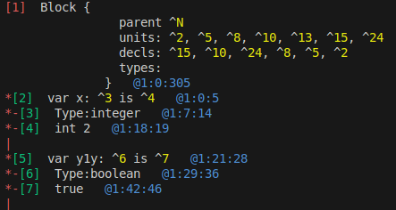

Compile options:
```bash
-DAST_DEBUG_ON=1
```
Will output Parser's AST contents

**Indicators of error**:
- `^0` describes a pointer to an object that was not created with `Ast::mk`. **These should never be in the output**!
- `^N` signifies `nullptr` - ensure that all pointers of the resulting AST are correct and not null where unintended
- `INVALID_` - some base classes that represent Expressions in `src/include/ast/Structs.h` print this out if there's no print implementation for the code they're assigned
- `*_base` - when printed, it probably means that parser's implementation created an object of a wrong class
- **Orphan nodes** before Analyzer stage
- **Bold red IdRef, RoutineCall, TypeRef** - any structs that have a **.ref** field, they are printed as bright red when the ref field is null (**should never happen if Analyzer has already run**)

